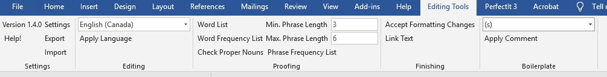

# editing-tools

These are just a couple tools I coded for use where I work. 

Features include a

* one-click language applicator,
* proper noun discrepancy checker,
* word list generator,
* "singular data" finder, and
* comment boilerplate manager.

The proper noun checker looks for proper nouns that sound similar and that differ by a customizeable editing distance. Useful for catching common typos in names.

The word list generator creates an alphabetized list of all the unique words in the document. Useful for proofreading.

If you find yourself making the same comments over and over, the boilerplate manager can save you lots of time.

## "Real" Editing Tools

Do *not* confuse this with the most excellent ["Edit Tools" by wordsnSync](http://www.wordsnsync.com/). Also check out [PerfectIt](http://www.intelligentediting.com/) and [the Editorium](http://www.editorium.com/). If you're looking for macros instead of plugins, check out [Paul Beverly's excellent book of macros](http://www.archivepub.co.uk/book.html).

## Disclaimers

I can't guarantee that this code will work in your version of Visual Studio or Word. Microsoft does not make that sort of maintainability easy!

I'm just sharing this because a couple people asked for the code. If you find it useful, great!

If you just want to see the algorithms, then you'll be most interested in the files `Ribbon1.cs` (which contains the code that runs when you click a ribbon button and describes the overall algorithms) and `TextHelpers.cs` (which contains all the little helper functions that make writing the algorithms easier).

I'm happy to answer questions, and I'm always open to suggestions for improvement.

Good luck!

## Licence

Released under the MIT license except where noted (the metaphone code).

Copyright (c) 2016 Aaron Dalton

Permission is hereby granted, free of charge, to any person obtaining a copy
of this software and associated documentation files (the "Software"), to deal
in the Software without restriction, including without limitation the rights
to use, copy, modify, merge, publish, distribute, sublicense, and/or sell
copies of the Software, and to permit persons to whom the Software is
furnished to do so, subject to the following conditions:

The above copyright notice and this permission notice shall be included in all
copies or substantial portions of the Software.

THE SOFTWARE IS PROVIDED "AS IS", WITHOUT WARRANTY OF ANY KIND, EXPRESS OR
IMPLIED, INCLUDING BUT NOT LIMITED TO THE WARRANTIES OF MERCHANTABILITY,
FITNESS FOR A PARTICULAR PURPOSE AND NONINFRINGEMENT. IN NO EVENT SHALL THE
AUTHORS OR COPYRIGHT HOLDERS BE LIABLE FOR ANY CLAIM, DAMAGES OR OTHER
LIABILITY, WHETHER IN AN ACTION OF CONTRACT, TORT OR OTHERWISE, ARISING FROM,
OUT OF OR IN CONNECTION WITH THE SOFTWARE OR THE USE OR OTHER DEALINGS IN THE
SOFTWARE.
